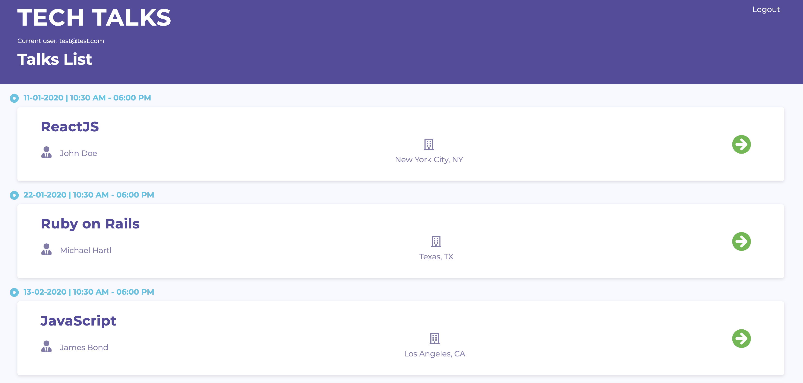

<!-- PROJECT SHIELDS -->
<!--
*** I'm using markdown "reference style" links for readability.
*** Reference links are enclosed in brackets [ ] instead of parentheses ( ).
*** See the bottom of this document for the declaration of the reference variables
*** for contributors-url, forks-url, etc. This is an optional, concise syntax you may use.
*** https://www.markdownguide.org/basic-syntax/#reference-style-links
-->
[![Contributors][contributors-shield]][contributors-url]
[![Forks][forks-shield]][forks-url]
[![Issues][issues-shield]][issues-url]
[![MIT License][license-shield]][license-url]


<!-- PROJECT LOGO -->
<br />
<p align="center">
  <a href="https://github.com/redvanisation/Tech-Talks">
    
  </a>

  <h2 align="center">TECH TALKS</h2>

  <p align="center">
    The final capstone project of the <b>Microverse</b> coding school Software Development curriculum, developed with <b>Ruby on Rails</b>, <b>ReactJS</b>, <b>React Router</b>, <b>Redux</b>, <b>Bootstrap</b> and <b>Sass</b>.
    <br />
    <br />
    <a href="https://tech--talks.herokuapp.com/" target="_blank">Live Link</a>
    ·
    <a href="https://github.com/Redvanisation/Tech-Talks/issues">Report Bug</a>
    ·
    <a href="https://github.com/Redvanisation/Tech-Talks/issues">Request Feature</a>
  </p>
</p>


<!-- TABLE OF CONTENTS -->
## Table of Contents

* [About the Project](#about-the-project)
  * [Built With](#built-with)
* [Getting Started](#getting-started)
  * [Prerequisites](#prerequisites)
  * [Installation](#installation)
* [Usage](#usage)
* [Contributing](#contributing)
* [License](#license)
* [Contact](#contact)
* [Future Implementations](#future-implementations)


<!-- ABOUT THE PROJECT -->
## About The Project

[![Product Name Screen Shot][product-screenshot]](https://tech--talks.herokuapp.com/)

This project was developed as the final capstone project in the Microverse coding school Software Development bootcamp, it consisted of making a responsive mobile-first app with a **Ruby on Rails** RESTful API in the back-end and **ReactJS** for the front-end, implementing **Redux** and **React Router** implemnting the responsive design techniques and the Test-driven development method.<br />
The app design is inspired from **[here](https://www.behance.net/gallery/71179603/HCIE-App-UIUX-Design)**, on this app as a registered user, you can see available tech talks in a timeline and you can check them for more details then you will be able to add them to your favorites timeline, the app also makes use of the **devise** Rails gem for a full user's authentication system and is deployed on **Heroku**, tested with **RSpec** and used **PostgreSQL** as the main database.


### Built With

* [Ruby on Rails](https://rubyonrails.org/)
* [ReactJS](http://reactjs.org/)
* [Redux](https://redux.js.org/)
* [React Router](https://github.com/ReactTraining/react-router)
* [Devise](https://github.com/heartcombo/devise)
* [Sass](https://sass-lang.com/)
* [Bootstrap](https://getbootstrap.com/)
* [RSpec](https://rspec.info/)
* [PostgreSQL](https://www.postgresql.org/)


<!-- GETTING STARTED -->
## Getting Started

To get a local copy up and running follow these simple steps.


### Prerequisites


* npm
```sh
npm install npm@latest -g
```

* yarn
```sh
npm install yarn -g
```


### Installation
 
1. Clone the repo
```sh
git clone https://github.com/redvanisation/Tech-Talks.git
```
2. Install Yarn packages
```sh
yarn install --check-files
```
3. Set-up, migrate and seed the Database
```sh
rails db:drop db:create db:migrate db:seed
```
4. Run the development server with only one of the below commands
```sh
./bin/webpack-dev-server
```
if that doesn't work then
```sh
./bin/webpack -w
```
5. Start Rails server with the below command then navigate to `localhost:3000` in your browser
```sh
rails s
```


<!-- USAGE EXAMPLES -->
## Usage

- You can use one of the seeded users to log-in or register a new one, the first seeded user has all the posts set as favorites and the second one doesn't have any favorites yet:
  - email: `red@red.com` password: `password`
  - email: `test@test.com` password: `password`
- After logging-in you will find a list of talks in a timeline you could click on the title or the arrow button to check more details about a talk, or you can access your favorites page by clicking the **star** button in the bottom.
- In the talk's details page you can find all the details about the talk, the location the speakers, the speciality and you can also add it to your favorites list by clicking `Add as fav` button, you will then be redirected to the favorites page.
- In the favorites page you can see which talks you added as favorites and you could click the title or the arrow button to access the talk's details page.


<!-- CONTRIBUTING -->
## Contributing

Contributions are what make the open source community such an amazing place to be learn, inspire, and create. Any contributions you make are **greatly appreciated**.

1. Fork the Project
2. Create your Feature Branch (`git checkout -b feature/AmazingFeature`)
3. Commit your Changes (`git commit -m 'Add some AmazingFeature'`)
4. Push to the Branch (`git push origin feature/AmazingFeature`)
5. Open a Pull Request


<!-- LICENSE -->
## License

Distributed under the MIT License. See `LICENSE` for more information.


<!-- CONTACT -->
## Contact

**Radouane Khiri** - [@redvanisation](https://twitter.com/redvanisation) - [LinkedIn](https://www.linkedin.com/in/redvan/) - redvanisation@gmail.com

**Tech Talks** [https://github.com/redvanisation/Tech-Talks](https://github.com/redvanisation/Tech-Talks)


<!-- Features to be implemented -->
## Future Implementations

* [ ] Create an admin panel to create / update / delete talks.
* [ ] The ability to delete favorites talks.
* [ ] Feedback section of the app


<!-- MARKDOWN LINKS & IMAGES -->
<!-- https://www.markdownguide.org/basic-syntax/#reference-style-links -->
[contributors-shield]: https://img.shields.io/github/contributors/Redvanisation/Tech-Talks
[contributors-url]: https://github.com/Redvanisation/Tech-Talks/graphs/contributors
[forks-shield]: https://img.shields.io/github/forks/Redvanisation/Tech-Talks
[forks-url]: https://github.com/Redvanisation/Tech-Talks/network/members
[issues-shield]: https://img.shields.io/github/issues/Redvanisation/Tech-Talks
[issues-url]: https://github.com/Redvanisation/Tech-Talks/issues
[license-shield]: https://img.shields.io/github/license/redvanisation/Tech-Talks
[license-url]: https://github.com/Redvanisation/Tech-Talks/blob/master/LICENSE.txt
[product-screenshot]: app/assets/images/screenshot2.png
